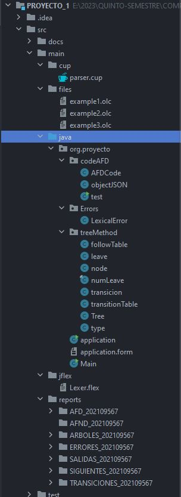
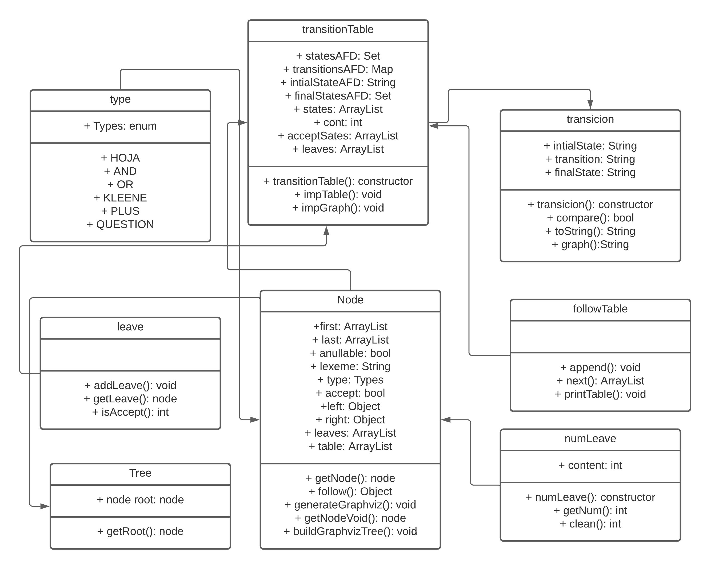
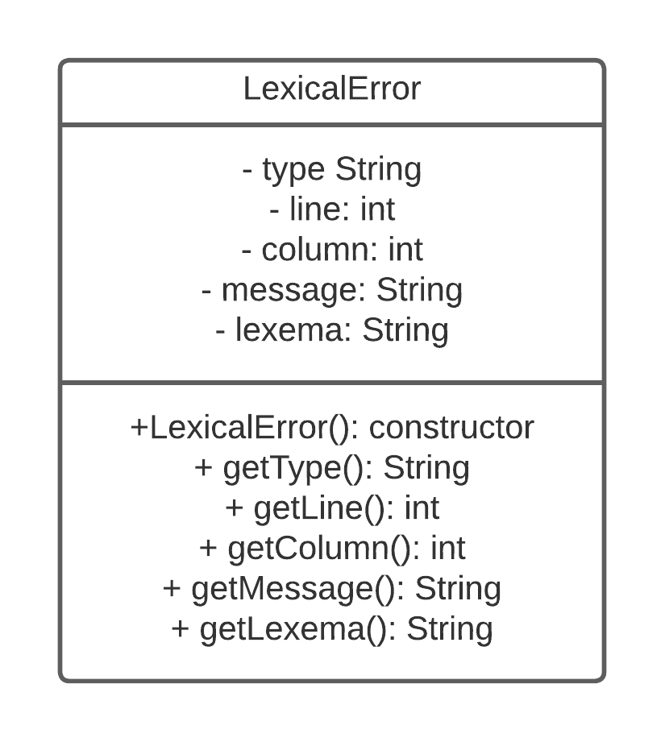
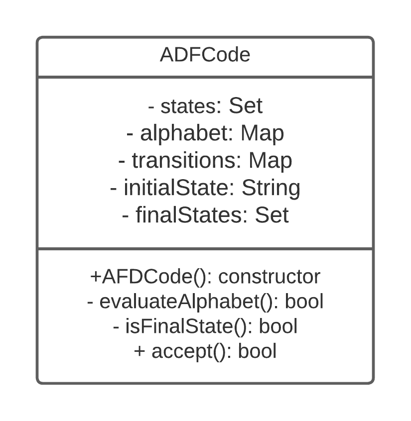

# **Proyecto 1**
### Universidad de San Carlos de Guatemala
### Facultad de Ingeniería
### Escuela de Ciencias y Sistemas
### Organización de Lenguajes y Compiladores 1
### Sección C
| Nombre | Carnet | 
| --- | --- |
| Alvaro Norberto García Meza | 202109567 |
----
# **Manual Técnico**

## **Introducción** 
Bienvenidos al manual técnico de la aplicación desarrollada en Java 
con interfaz gráfica Swing para el análisis léxico y sintáctico de una 
cadena de entrada. Esta aplicación es capaz de reconocer patrones de texto 
mediante el uso de expresiones regulares, y a partir de ellas construye un 
analizador léxico con Jflex y un analizador sintáctico con JCup.

Los resultados de la aplicación incluyen diversos reportes para cada expresión 
regular detectada, como un árbol sintáctico, una tabla de siguientes, tabla de 
transiciones, un AFD y un AFND. Además, cuenta con reporte de errores esta 
por ultimo, aplicación cuenta con un algoritmo para validar ciertas cadenas 
mediante la notación polaca de cada expresión regular.

## **Requerimientos del Software**
En este documento se presentan los requerimientos de software necesarios para instalar y ejecutar la aplicación de análisis léxico y sintáctico desarrollada en Java con interfaz gráfica Swing, utilizando los plugins de JFlex y JCup dentro del framework Maven.

Para poder utilizar esta aplicación, se requiere tener instalado Java en su versión 8 o superior. Además, se necesitan las herramientas de JFlex y JCup, que son utilizadas para generar los analizadores léxicos y sintácticos, respectivamente. En particular, se utilizaron las versiones 1.7.0 de JFlex y 1.6.3 de JCup para el desarrollo de esta aplicación.

Es importante destacar que la aplicación ha sido desarrollada utilizando el framework Maven en su última versión. Por lo tanto, se recomienda tener instalado Maven en su versión más actualizada para poder compilar y construir la aplicación de forma adecuada.

Además, se deben instalar los plugins de JFlex y JCup en el archivo "pom.xml" del proyecto, para que el proceso de construcción de la aplicación pueda generar los analizadores léxicos y sintácticos. Es importante utilizar las últimas versiones de estos plugins para asegurar la compatibilidad y el correcto funcionamiento de la aplicación.

En resumen, los requerimientos de software necesarios para instalar y ejecutar la aplicación son los siguientes:

- Java versión 8 o superior.
- JFlex versión 1.9.0 o superior.
- JCup versión 11b-20160615-2 o 11b-20160615-1.
- Maven última versión (19).

Plugins de JFlex y JCup instalados y configurados en el archivo "pom.xml" del proyecto.
## **Instalación**
A continuación, se presentan las instrucciones detalladas para instalar la aplicación de análisis léxico y sintáctico desarrollada en Java con interfaz gráfica Swing, utilizando los plugins de JFlex y JCup dentro del framework Maven.
Las instrucciones para instalar la aplicación son las siguientes:

1. Descargar e instalar Java.
2. Descargar e instalar Maven.
3. Descargar e instalar JFlex y JCup.
4. Descargar el código fuente de la aplicación.
5. Configurar el archivo "pom.xml".
6. Compilar y construir la aplicación.
7. Ejecutar la aplicación.

## **Estructura del Código**
Al crear un proyecto con el IDE intellIJ proporciona una estructura para 
comenzar a trabajar los diferentes archivos .java de la aplicación. 
En la carpeta main se encuentran todos los archivos necesarios para hacer 
funcionar dicha aplicación. En el cup se cuenta con el archivo .cup para 
hacer la gramática y compilarlo y obtener la clase del Parser, en la carpeta 
jflex se encuentra de igual manera el archivo .flex para declarar nuestras 
expresiones regulares y definir los tokens, dicha clase al ser compilada 
genera una clase lexer la cual se relación con la clase anterior del JCup 
para poder trabajar. Luego se tiene la carpeta reports la cual cuenta con 
todos los reportes generados de la aplacación, como pueden ser: el árbol 
sintáctico, tabla siguientes, tabla de transiciones, AFD, AFND y una tabla 
de errores. 

Dentro de la carpeta java se encuentra el paquete que contiene 
el código que le da la funcionalidad a toda la aplicación. Como primera 
parte se encuentran las clases generadas de los archivos del JCup y JFlex, 
luego una carpeta para manejar los errores, construir el código del AFD a 
partir de una tabla de transiciones y el método del árbol el cual genera 
los diferentes reportes. Por último, a nivel del paquete se encuentra el a
rchivo que contiene el código para crear la interfaz gráfica.


## **Análisis Léxico**
El análisis léxico es el proceso de reconocer los tokens de una cadena de
entrada. Para este proyecto se utilizó la herramienta JFlex para generar el
análisis léxico. JFlex es una herramienta que permite generar analizadores
léxicos a partir de expresiones regulares. El analizador léxico generado
por JFlex se compone de una clase Lexer, que contiene un método yylex()
que devuelve el siguiente token de la cadena de entrada. El método yylex()
devuelve un objeto de la clase Symbol, que contiene el token y su valor.

## **Análisis Sintáctico**
El análisis sintáctico es el proceso de reconocer la estructura de una
cadena de entrada. Para este proyecto se utilizó la herramienta JCup para
generar el análisis sintáctico. JCup es una herramienta que permite
generar analizadores sintácticos a partir de una gramática. El analizador
sintáctico generado por JCup se compone de una clase Parser, que contiene
un método parse() que devuelve el árbol sintáctico de la cadena de entrada.
El método parse() devuelve un objeto de la clase Symbol, que contiene el
token y su valor.
### Gramática de la aplicación
 ```
 Terminales = {  LBRACE, RBRACE, CONJ, ID, ARROW1, ARROW2, SEMICOLON, COLON, TILDE,
                SPECIAL, LETTER, NUMBER, PLUS, STAR, QUESTION, OR, DOT, COMMA, STRING,PERCENT
                SIMB1, SIMB2, SIMB3,UNDERSCORE }

No Terminales = { ini,body, option, option_2, re}

ini ::= LBRACE body RBRACE

body ::= CONJ COLON ID ARROW1 ARROW2 option TILDE option SEMICOLON body
        | CONJ COLON ID ARROW1 ARROW2 option_2 SEMICOLON body
        | ID ARROW1 ARROW2 re SEMICOLON body
        | PERCENT  body
        | ID COLON STRING:var SEMICOLON body
        | epsilon

re ::=
      |SIMB1 re
      |SIMB2 re
      |SIMB3 re
      |PLUS  re
      |STAR  re
      |QUESTION re
      |OR re
      |DOT re
      |LBRACE ID RBRACE re
      |STRING re

option ::= LETTER
          |NUMBER
          |SPECIAL

option_2 ::= LETTER  COMMA option_2
            |NUMBER  COMMA option_2
            |SPECIAL COMMA option_2
            |UNDERSCORE COMMA option_2
            |option

  ```
## **Diagrama de clases**
- Diagrama de clases para la construcción del árbol sintáctico, nodos, tabla 
    de siguientes, tabla de transiciones, AFD y AFND.
  
- Diagrama de clases para la guardar los errores de la aplicación.
  
- Diagrama de clases para validar cadenas mediante la notación polaca de cada 
    expresión regular.
  

## **Componentes para la interfaz gráfica**
- **JFrame**: Es una clase que hereda de la clase Container, y que representa una ventana en la pantalla.
- **JPanel**: Es una clase que hereda de la clase Container, y que representa un contenedor de componentes.
- **JLabel**: Es una clase que hereda de la clase Component, y que representa un texto o imagen.
- **JTextArea**: Es una clase que hereda de la clase JTextComponent, y que representa un área de texto.
- **JScrollPane**: Es una clase que hereda de la clase JComponent, y que representa un contenedor que permite desplazarse por un área de texto.
- **JButton**: Es una clase que hereda de la clase AbstractButton, y que representa un botón.
- **JFileChooser**: Es una clase que hereda de la clase JComponent, y que representa un cuadro de diálogo para seleccionar un archivo.
- **JTabbedPane**: Es una clase que hereda de la clase JComponent, y que representa un panel de pestañas.
- **JMenuBar**: Es una clase que hereda de la clase JComponent, y que representa una barra de menú.
- **JMenu**: Es una clase que hereda de la clase JMenuItem, y que representa un menú.

## **Métodos de la aplicación**
- **application**: Método principal de la aplicación, se encarga de crear la
  interfaz gráfica y mostrarla al usuario.
- **accept():** Método que se encarga de validar si la cadena ingresada por el
  usuario es aceptada por el autómata finito determinista.
   ```java
  public boolean accept(String word) {
        String currentState = initialState; // start in the initial state
        // iterate over the word
        for( char c: word.toCharArray()) {
            // First search de intialState in the transitions
            for(Map<String, String> transition : transitions.get(currentState) ){
                // if the array is equal to 1, evaluate literals
                if(transition.size() == 1){
                    // if the transition contains the current character, change the current state
                    if(transition.containsKey(String.valueOf(c))){
                        currentState = transition.get(String.valueOf(c));
                        break;
                    }else {
                        // Evaluate if that character is on the alphabet
                        if(evaluateAlphabet(String.valueOf(c))){
                            // find the key that contains the current character type to change the current state
                            if( setName != null && transition.containsKey(setName)) {
                                currentState = transition.get(setName);
                                break;
                            }else {

                            }
                        }
                        return false;
                    }
                } else if (transition.size() > 1 ){
                    // if the key array contains the current character, change the current state
                    if(transition.containsKey(String.valueOf(c))){
                        currentState = transition.get(String.valueOf(c));
                        break;
                    } else {
                        // if the key array doesn't contains the current character, check if the key array contains the current character type
                        if(evaluateAlphabet(String.valueOf(c))){
                            // find the key that contains the current character type to change the current state
                            if( setName != null && transition.containsKey(setName)) {
                                currentState = transition.get(setName);
                                break;
                            }
                        }else {
                            return false;
                        }
                    }

                }

            }
        }
        // if the current state is a final state, the word is accepted
        return isFinalState(currentState);
    }
    ```
- **generateAnalyzeActionPerfomed**: Método que se encarga de generar el
  análisis léxico y sintáctico de la cadena de entrada. Generar los reportes
    del árbol sintáctico, tabla de siguientes, tabla de transiciones, AFD y AFND.
    ```java
  private void generateAnalyzeActionPerformed(java.awt.event.ActionEvent evt) {//GEN-FIRST:event_generateAnalyzeActionPerformed
        // TODO add your handling code here:
        // Import from parser and lexer
        Lexer lexer = new Lexer(new StringReader(codeArea.getText()));
        Parser parser = new Parser(lexer);
  
        try {
            parser.parse();
        } catch (Exception ex) {
            Logger.getLogger(application.class.getName()).log(Level.SEVERE, null, ex);
        }

        // errors
        ArrayList<LexicalError> errors = new ArrayList<>();
        ArrayList<LexicalError> errorsLexer = lexer.errors;
        errors.addAll(errorsLexer);
        errors.addAll(parser.getErrors());
        try {
            generateHTMLErros(errors);
        } catch (IOException ex) {
            Logger.getLogger(application.class.getName()).log(Level.SEVERE, null, ex);
        }

        // GENERATE THE GLOBAL ALPHABET
        Map<String, List<String>> globalAlphabet = new HashMap<>();
        for(String alphabet : parser.alphabet_1){ // First alphabet with the format a ~ z
            List<String> rangeList = new ArrayList<String>(); // create a list
            String[] range = alphabet.split("~"); // split the string by ~
            // iterate over the range
            for (int i = (int) range[1].charAt(0); i <= (int) range[2].charAt(0); i++) {
                char c = (char) i;
                rangeList.add(Character.toString(c));
            }
            globalAlphabet.put(range[0],  rangeList);
        }
        for(String alphabet : parser.alphabet_2){ // Second alphabet with the format a,b,c,d,e,f,g,h,i,j,k,l,m,n,o,p,q,r,s,t,u,v,w,x,y,z
            List<String> rangeList = new ArrayList<String>(); // create a list
            String[] range = alphabet.split("~"); // split the string by ~
            // iterate over the range
            for (int i = 0; i < range[1].length(); i++) {
                rangeList.add(Character.toString(range[1].charAt(i)));
            }
            globalAlphabet.put(range[0],  rangeList);
        }
        // reverse the arraylist
        Collections.reverse(parser.identifiersName);
      
        String regularExpression = parser.results.get(0);
        // split the regular expression by NEXT
        String[] regularExpressionArray = regularExpression.split("NEXT");
        // remove the first element
        String[] regularExpressionArrayNew = Arrays.copyOfRange(regularExpressionArray, 1, regularExpressionArray.length);
        // iterate over the array
        StringBuilder printConsole = new StringBuilder();
        for (int i = 0; i < regularExpressionArrayNew.length; i++) {
            // Array of results
            ArrayList<objectJSON> resultsJSON = new ArrayList<>();
            
            // get the name of the regular expresion
            String regularExpresionName = parser.identifiersName.get(i);
            // remove the first and last character
            regularExpressionArrayNew[i] = regularExpressionArrayNew[i].substring(1, regularExpressionArrayNew[i].length() - 1);
            System.out.println(regularExpressionArrayNew[i]);
            // evaluate the index is the last of the array
            String expresionString;
            String replace = regularExpressionArrayNew[i].replace("[", "").replace("]", "");
            if(i == regularExpressionArrayNew.length - 1){
                // add to the arraylist # and the beginning and . and the end
                expresionString = "#," + replace.replace(" ","") + ",.";
            }else {
                // add to the arraylist # and the beginning and . and the end
                expresionString = "#," + replace.replace(" ","") + ".";
            }
            // GENERATE EACH TREE, TABLES AND AFD
            // create arraylist
            ArrayList<node> leaves = new ArrayList<>();
            ArrayList<ArrayList> table = new ArrayList<>();
            // Create the tree
            Tree tree = new Tree(expresionString,leaves, table );
            node raiz = tree.getRoot();
            raiz.getNode(); // DETERMINA SI LOS NODOS SON ANULABLES, SUS PRIMEROS Y ULTIMOS
            raiz.follow();
            System.out.println("==============================VALORES NODO ULTIMO . Y TABLA HOJAS ==============================");
            // Create a function to generate the graphviz code of the tree
            raiz.generateGraphviz(regularExpresionName);
            System.out.println("==============================TABLA SIGUIENTES==============================");
            followTable ft = new followTable();
            ft.printTable(table,regularExpresionName);
            System.out.println("=============================TABLA TRANSICIONES=============================");
            // create a new alphabet with words that are inside of leaves
            Map<String, List<String>> alphabet = new HashMap<>();
            for (node alp : leaves) {
                // elimante the elements inside of globalAlphabet
                if( globalAlphabet.containsKey(alp.lexeme)){
                    List<String> list = globalAlphabet.get(alp.lexeme);
                    alphabet.put(alp.lexeme, list);
                }
            }
            transitionTable tran = new transitionTable(raiz, table, leaves);
            tran.impTable(regularExpresionName);
            System.out.println("States -> " + tran.statesAFD);
            System.out.println("Alphabet -> " + alphabet );
            System.out.println("Transitions -> " + tran.transitionsAFD);
            System.out.println("Initial State -> " + tran.initialStateAFD);
            System.out.println("Accept States ->"+ tran.finalStatesAFD);
            System.out.println("============================= GRAPHVIZ AFD===============================================");
            tran.impGraph(regularExpresionName);
            System.out.println("============================= EVALUATE AFD ===============================================");
            // CREATE THE AFD
            // Variables declaration - do not modify                     
            AFDCode afd = new AFDCode(tran.statesAFD, alphabet, tran.transitionsAFD, tran.initialStateAFD, tran.finalStatesAFD);
            // EVALUATE THE SENTENCE inside the map with values in an array
            for (String sentence : parser.StringsToEvaluate.keySet()) {
                // get the value inside the map
                if(sentence.equals(regularExpresionName)){
                    String[] values = parser.StringsToEvaluate.get(sentence).toArray(new String[0]);
                    // iterate over the array
                    for(String val: values) {
                        // evaluate the sentence
                        String newVal = val.replace("\\", "");
                        System.out.println("Value: " + newVal);
                        boolean result = afd.accept(newVal);
                        System.out.println("Result: " + newVal);
                        // create a json object
                        if( result ) {
                            objectJSON obj = new objectJSON(newVal,regularExpresionName, "Cadena Válida");
                            
                            printConsole.append("La expresión: ").append(newVal).append(" Es válida con la expresión Regular -> ").append(regularExpresionName).append("\n");
                            resultsJSON.add(obj);
                        }else {
                            objectJSON obj = new objectJSON(val,regularExpresionName, "Cadena No Válida");
                            printConsole.append("La expresión: ").append(newVal).append(" No es válida con la expresión Regular -> ").append(regularExpresionName).append("\n");
                            resultsJSON.add(obj);
                        }
                    }
                    // GENERATE THE JSON FILE
                    generateJSON(resultsJSON, regularExpresionName);
                }
            }
        }
        // SHOW MESSAGE OF GOD
        JOptionPane.showMessageDialog(null, "Proceso Terminado");
        // SHOW IN THE TEXTAREA (CONSOLE)
        consoleArea.setText(printConsole.toString());
        // ADD TO THE LIST SWIG THE NAME OF THE regular expresions
        DefaultListModel<String> model = new DefaultListModel<>();
        for(String str: parser.identifiersName){
            model.addElement(str);
        }
        listTree.setModel(model);
        listFollow.setModel(model);
        listTrans.setModel(model);
        listAutoma.setModel(model);
    }//GEN-LAST:event_generateAnalyzeActionPerformed
    ```
