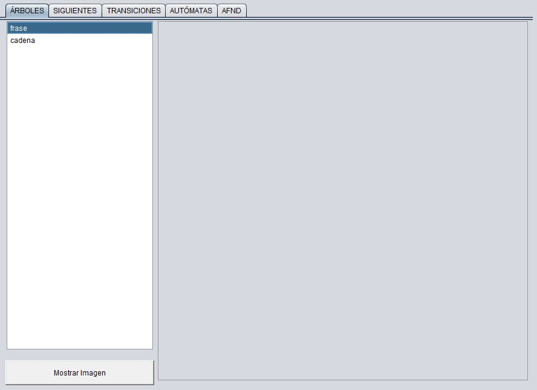
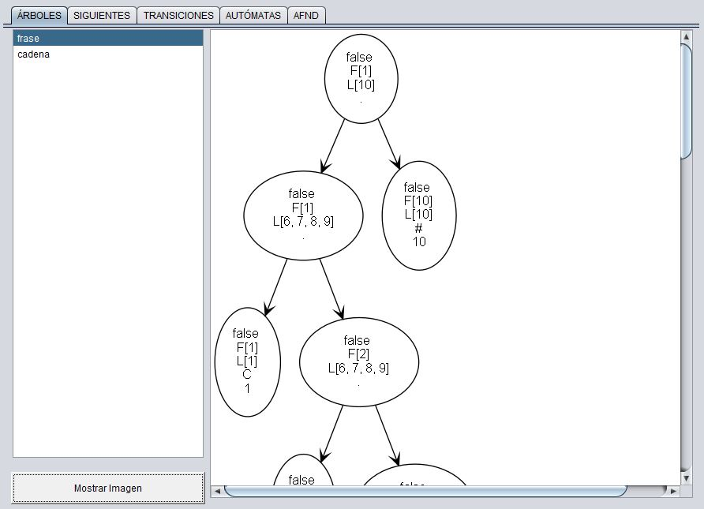

# **Proyecto 1**
### Universidad de San Carlos de Guatemala
### Facultad de Ingeniería
### Escuela de Ciencias y Sistemas
### Organización de Lenguajes y Compiladores 1
### Sección C
| Nombre | Carnet | 
| --- | --- |
| Alvaro Norberto García Meza | 202109567 |
----
# **Manual de Usuario**

## **Descripción General**
Este proyecto consiste en un compilador para reconcer un lenguaje en especifico. 
El compilador consta de 3 etapas: **Análisis Léxico**, **Análisis Sintáctico**,
**Generación de reportes** y **Validación de cadenas**. 
El compilador se desarrolló en el lenguaje de programación **Java** implementando
una interfaz gráfica para facilitar la interacción con el usuario.

## **Requerimientos**
Para poder ejecutar el compilador se requiere tener instalado el **JDK** de Java
en su versión 8 o superior.

## **Ejecución**
Para ejecutar el compilador se debe abrir una terminal en la carpeta donde se
encuentra el archivo **.jar** y ejecutar el siguiente comando:

    java -jar Proyecto1.jar

## **Archivo de entrada**

El archivo de entrada debe tener la extensión **.olc** y debe contener el código
a compilar. El archivo de entrada debe tener la siguiente estructura:

    <! -- Comentario multiliena, estos pueden ir en cualquier parte del archivo !>
    // Comentario de una linea, estos pueden ir en cualquier parte del archivo
    { 
    <CONJ>: <identificador> -> <caracter>, <caracter>, <caracter>, ... ;
    <CONJ>: <identificador> -> <caracter> ~ <caracter> ;
    ...
    <identificador> -> <expresión regular en notación polaca> ;
    ...
    %% 
    %%
    <indentificador> : <cadena> ;
    ...
    }
Aquí se muestra un ejemplo de un archivo de entrada:
 ```
 // #############  ESTE ES UN COMENTARIO DE UNA SOLA LINEA, POR LO QUE NO DEBE
//##############  DAR NINGUN PROBLEMA///////////////////---------

{

CONJ: numero - > 0,1,2,3,4, 5,6,7,   8, 9 ;
CONJ: minuscula -     > a ~  z ;
CONJ: mayuscula -> A,B,C,D,E,F,G,H,I,J,K,L,M,N,O,P,Q,R,S,T,U,V,W,X,Y,Z;
CONJ: simbolos - > -,_;

//$%$%$%$%$%$%$%&/&/&/&/& ESTO NO DEBE DAR POBLEMA ============

correoElectronico -> .|{minuscula} {mayuscula} . + | | | {simbolos} {minuscula} {mayuscula} {numero} . "@" . + | {minuscula} {mayuscula} . ".". "c" . "o" "m";
url -> . "h". "t". "t". "p".?"s".":"."/"."/". + {minuscula} . "." + {minuscula};

%%
    %%

<!
                SECCIÓN DE PRUEBAS
                    #YASALIO
    !>

url : "https://facebook.com"; //correcto
url : "http://google.es"; //correcto
url : "https://compiladores-1.com"; //incorrecto

correoElectronico : "lachalana666@ingusac.com"; //correcto
correoElectronico : "micorreo_123@gMAIL.com"; //correcto
correoElectronico : "compiladores1.lab@hotMAIL.es"; //incorrecto

}
 ```

## **Interfaz**
La interfaz del compilador consta de 3 secciones principales: **Código**, **Reportes**
y **Cadena**.

### **Uso de la aplicación**
Para analizar un archivo de entrada se debe hacer lo siguiente.
Seleccionar el archivo de entrada con el botón **Archivo**. Acá se puede abrir un
archivo, guardar un archivo o crear o guardar como un archivo nuevo.


Al dar click en **Abrir** se abrirá una ventana para seleccionar el archivo de
entrada. Se debe seleccionar el archivo y dar click en **Abrir**.


El archivo se cargará en la sección **Código**. La cual esta comformada de 
un **JTextArea** y un **JScrollPane**. El **JTextArea** es el área donde se
muestra el código del archivo de entrada. El **JScrollPane** es el scroll que
permite desplazarse por el código. Dentro del **JTextArea** se puede seleccionar
el texto y copiarlo con **Ctrl + C** o cortarlo con **Ctrl + X**. También se
puede pegar texto con **Ctrl + V**, además se puede modificar el texto.

En esta sección tambien se encuentra un botón **Analizar**. Al dar click en este
botón se analizará el archivo de entrada, el cual analizará todo el código que se 
encuentre en el **JTextArea**.


Si el archivo de entrada no tiene errores de sintaxis se mostrará un mensaje
de que el archivo se analizó correctamente. Además se mostrará el reporte de
análisis léxico y el reporte de análisis sintáctico.


En la consola se mostrará las cadenas que se analizaron y si son aceptadas o
rechazadas. Ademas en la parte de los reportes aparecerá el nombre de la imagen
generada por la aplicación.


Al seleccionar el nombre de la imagen y darle click en el botón **Mostrar imagen**
se abrirá la imagen en el panel de la derecha.



Acá se muestra como se ve la imagen generada por la aplicación.




